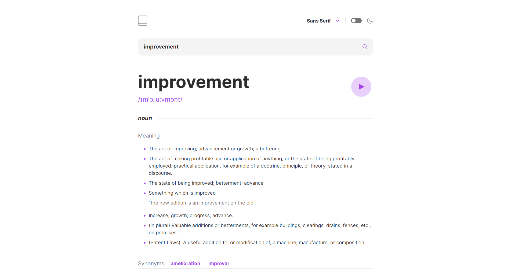

# Frontend Mentor - Dictionary Web App

This is a solution to the [Dictionary Web App challenge on Frontend Mentor](https://www.frontendmentor.io/challenges/dictionary-web-app-h5wwnyuKFL).

## Preview

## Links

- Solution URL: [Solution URL](https://www.frontendmentor.io/solutions/my-ugly-solution-NnYHDx3LRq)
- Live Site URL: [Live Solution](https://dictionary-web-app-five.vercel.app/)

## Built with

- HTML5
- CSS

## Author

- Website - [Jesus Venegas](https://www.jesusvenegas.com) (WIP)
- Frontend Mentor - [@kasdeya](https://www.frontendmentor.io/profile/kasdeya)

## Acknowledgments

- Inspiration by [Front End Mentor](https://www.frontendmentor.io/)
